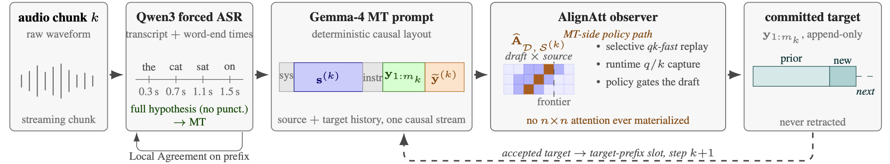
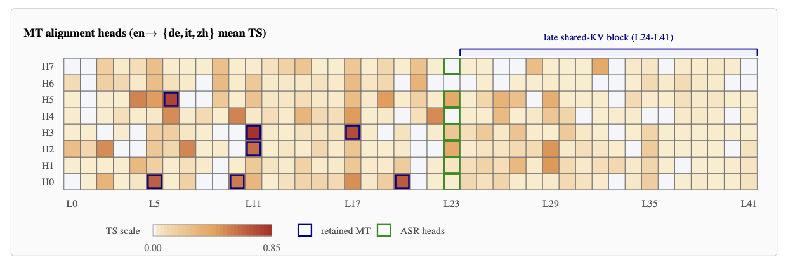
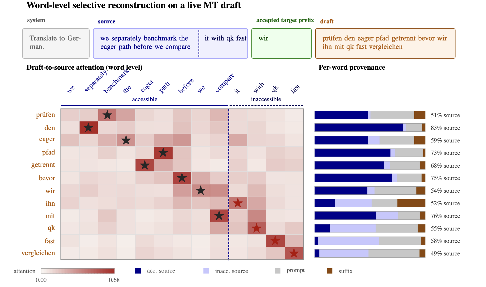
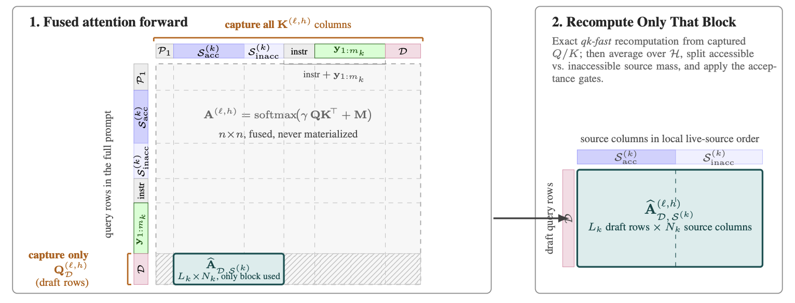
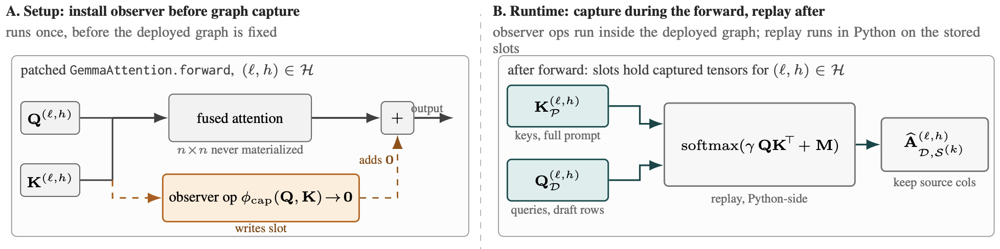
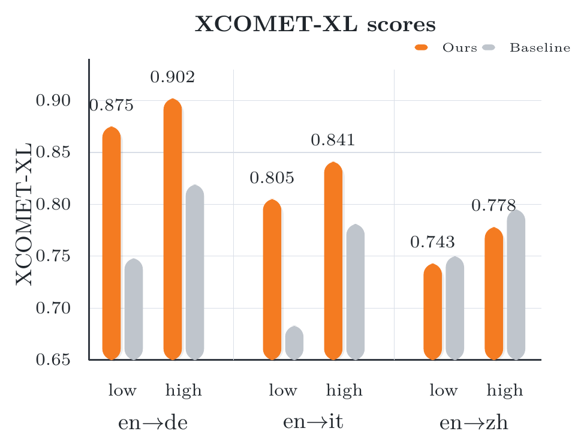
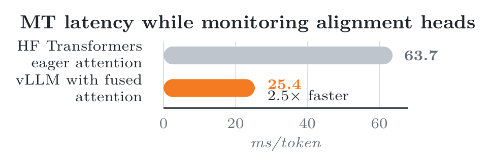
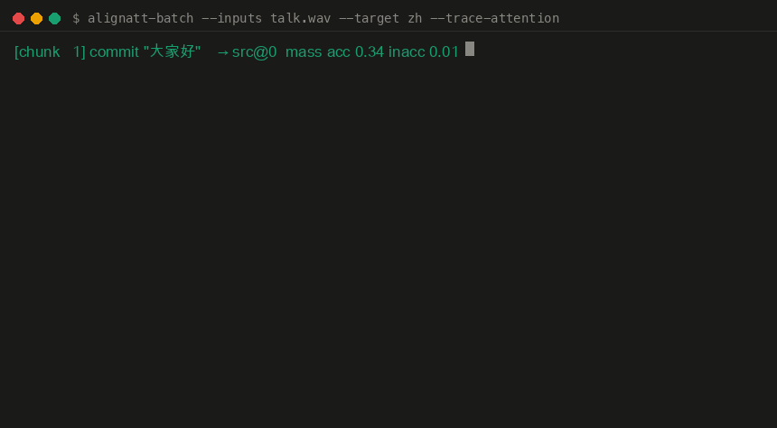

<h1 align="center">
  
  <br/>
  AlignAtt4LLM
</h1>

> [AlignAtt4LLM: Fast AlignAtt for Decoder-Only LLMs at IWSLT 2026
> Simultaneous Speech Translation Task](https://arxiv.org/abs/2606.03967)

**AlignAtt4LLM** adapts [AlignAtt](https://arxiv.org/abs/2305.11408) to decoder-only LLMs for simultaneous speech translation. The MT model drafts a translation from the current source prefix, the runtime reconstructs target-to-source attention from selected decoder attention heads, and only the target prefix that is supported by accessible source evidence is emitted.

<p align="center">
  
</p>

## Decoder-only LLMs have translation alignment heads

AlignAtt was designed for encoder-decoder models, where cross-attention gives a natural target-to-source alignment. Decoder-only LLMs have no cross-attention, but they contain [translation alignment heads](https://openreview.net/forum?id=q8fTgw8e5E): scoring every (layer, head) pair for how well its attention tracks the source words being translated shows that a small number of heads align well. In Gemma:

<p align="center">
  
</p>

The policy only needs those few calibrated heads, which is what keeps the reconstruction cheap.

## The core ideas

**1.** Reconstructing the attention, to know *where to cut*:

<p align="center">
  
</p>

**2.** Recomputing attention from a fused kernel to keep inference *fast*:

<p align="center">
  
</p>

**3.** Capturing keys and queries at runtime in [vLLM](https://github.com/vllm-project/vllm) to keep inference *really fast*:

<p align="center">
  
</p>

## Results

Translation quality against the organizer baseline (XCOMET-XL, low/high latency regimes), and MT decode latency with alignment-head monitoring enabled:

<p align="center">
  
</p>

<p align="center">
  
</p>

Details and full tables are in [Results](docs/results.md) and [Benchmarks](docs/benchmarks/README.md).

## Scope

The IWSLT implementation is end-to-end: it includes ASR, chunk-synchronous runtime code (synchronicity comes from the requirement to use [SimulStream](https://arxiv.org/abs/2512.17648)), and MT. This makes the full ASR + MT cascade runnable from audio input to simultaneous translation output.

## Use with WhisperLiveKit

The MT half also serves external ASR frontends over WebSocket: `alignatt-mt-server` receives committed source words (plus, optionally, the unstable hypothesis tail) and returns append-only translation deltas, releasing held target tokens on upstream commits without re-drafting. [WhisperLiveKit](https://github.com/QuentinFuxa/WhisperLiveKit) is the reference client (`--translation-backend alignatt`). Protocol spec: [docs/mt_server_protocol.md](docs/mt_server_protocol.md).

```bash
alignatt-mt-server --preset gemma_low_latency --port 8765
```

## Install

```bash
git clone https://github.com/QuentinFuxa/Alignatt4LLM
cd Alignatt4LLM

# Inference env (.venv-inference): pins the vLLM/CUDA stack and patches qwen_asr
tools/bootstrap/setup_inference_qwen_asr_vllm.sh

# Evaluation env (.venv-evaluation): OmniSTEval + XCOMET scoring
uv venv .venv-evaluation --python 3.13
UV_PROJECT_ENVIRONMENT=.venv-evaluation uv sync --group evaluation
```

Models are resolved from the local Hugging Face cache and are not downloaded automatically. For the default ASR route and the stable Gemma MT route:

```bash
huggingface-cli download Qwen/Qwen3-ASR-1.7B --revision 7278e1e70fe206f11671096ffdd38061171dd6e5

huggingface-cli download Qwen/Qwen3-ForcedAligner-0.6B --revision c7cbfc2048c462b0d63a45797104fc9db3ad62b7

huggingface-cli download google/gemma-4-E4B-it --revision 83df0a889143b1dbfc61b591bbc639540fd9ce4c
```

## See where Gemma listens

The runtime already reconstructs, for every drafted token, **where in the source it attends**, and prints that live on stderr as each token is committed or held:

<p align="center">
  
</p>

Standalone Gemma AlignAtt ASR. Watch where each transcript token lands on the audio timeline (`src@frame (seconds)`):

```bash
alignatt-gemma-asr \
  --wavs audio.wav \
  --output-dir outputs/gemma_asr_trace \
  --trace-attention
```

```
[chunk   1] commit "Hi"         → src@2 (0.12s)
[chunk   2] commit " Si"        → src@52 (2.12s)
[chunk   2] commit " Yuan"      → src@52 (2.12s)
[chunk   3] commit " F"         → src@75 (3.04s)
[chunk   3] commit "udan"       → src@89 (3.60s)
[chunk   3] commit " Universit" → src@92 (3.72s)
```

The full cascade, end to end. The MT trace adds the accessible / inaccessible attention-mass split that drives the *where to cut* decision:

```bash
alignatt-batch \
  --inputs audio.wav --target zh \
  --mt-backend-name gemma_vllm_alignatt \
  --trace-attention \
  --output-dir outputs/gemma_zh_smoke
```

```
[chunk   1] commit "大家好"   → src@0   mass acc 0.34 inacc 0.01
[chunk   2] commit "来自"     → src@9   mass acc 0.47 inacc 0.10
[chunk   2] commit "复"       → src@9   mass acc 0.63 inacc 0.06
[chunk   9] HOLD   "经常"     → src@26  mass acc 0.03 inacc 0.68 > frontier → cut
```

The last line is the policy at work: that draft token's attention is 0.68 on source that has not arrived yet, so it is held rather than emitted.

## Bring your own LLM

The portable part of AlignAtt4LLM is the MT-side policy, not the model. A new decoder-only LLM plugs into the same runtime by supplying a `VLLMAttentionSpec` (which vLLM attention class to patch and how its `forward` recomputes Q/K) plus a thin backend subclass, and reuses the shared capture/reconstruction/acceptance machinery in [`src/alignatt4llm/vllm_qk/`](src/alignatt4llm/vllm_qk/).

The shipped worked example is [Qwen3](src/alignatt4llm/mt/qwen_vllm_backend.py) (`qwen_vllm_alignatt`):

```bash
alignatt-batch \
  --inputs audio.wav --target de \
  --mt-backend-name qwen_vllm_alignatt \
  --output-dir outputs/qwen_de_smoke
```

The full recipe (find your attention class → write a spec → subclass the backend and worker → register → calibrate heads) is in [Adding a New LLM](docs/adding_a_model.md).

## Public CLI

- `alignatt-batch`: run the streaming cascade over one or more media files.
- `alignatt-compare`: single-WAV A/B of two backends with WER/CER/latency.
- `alignatt-eval`: score emitted hypotheses with OmniSTEval-compatible files.
- `alignatt-preset`: run named operating points (`gemma_low_latency`, `gemma_high_latency`) in batch or server mode.
- `alignatt-gemma-asr`: standalone Gemma AlignAtt ASR probe.
- `alignatt-mt-parity`: MT backend parity/diagnostic harness.

## Citation

```bibtex
@article{fuxa2026alignatt4llm,
  title = {AlignAtt4LLM: Fast AlignAtt for Decoder-Only LLMs at IWSLT 2026 Simultaneous Speech Translation Task},
  author = {Fuxa, Quentin and Macháček, Dominik},
  year = {2026},
  doi = {10.48550/arXiv.2606.03967},
  url = {https://arxiv.org/abs/2606.03967}
}
```
